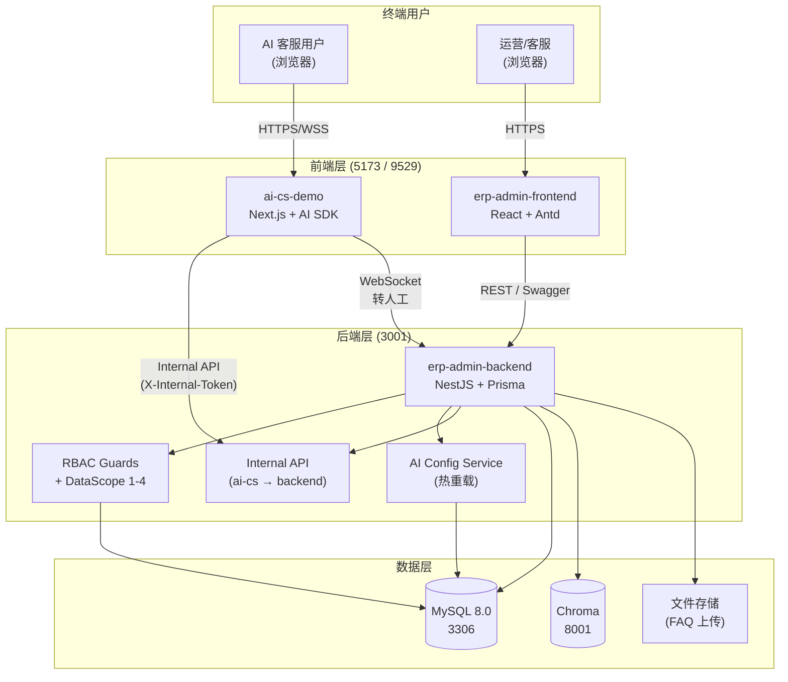

# W11-ERP — 智能 ERP 运营后台 + AI 客服(Monorepo)

> 一站式 monorepo:NestJS 后端 + React 前端 + Next.js AI 客服,共享 MySQL / Chroma,
> 一键 `make dev-all` 起开发 / `make up` 起生产。

**项目位置**:`/Users/suesea/sueSea/agents/W11-erp-admin/`
**计划书**:`../../docs/superpowers/plans/2026-06-24-w11-erp-admin.md`
**Monorepo 整合 commit**:W11 plan `e90bc07` 7/7 收口(2026-07-17)

---

## 简介

W11 ERP Admin 把三个原本独立的子系统整合进一个 monorepo,共享同一套 MySQL + Chroma +
CI/CD + 部署脚本:**运营后台**(NestJS + React)给内部客服/运营使用,**AI 客服 Demo**
(Next.js)给终端客户对话。后台改 AI 配置 → 前台立即热重载,无需重启。

---

## ✨ 特性

- **RBAC 4 级数据权限** — 平台/租户/部门/本人四级 DataScope,Guards + 装饰器声明式鉴权
- **AI 配置热重载** — 后台改模型 / API Key / Prompt,前台 1 小时内自动生效(无需重启服务)
- **AI 客服 Demo 集成** — Next.js 终端用户对话,WebSocket 实时转人工,共享后端 Internal API
- **多环境矩阵** — `development` / `test` / `uat` / `production` 4 套独立 env + compose overlay,GitHub Actions CI 自动跑全环境
- **一键启动** — `make dev-all`(本机开发)/ `make up`(Docker 生产)两种模式
- **完整 DevOps** — 健康检查 / 备份恢复 / SSL 续期 / 报警 / 日志轮转 / PM2 → Docker 迁移
- **100+ E2E 测试** — Playwright + Jest 双覆盖,关键路径 100% 通过
- **Mermaid 文档** — 架构图、流程图全部随代码仓库走,版本对齐

---

## 📦 子项目

| 子项目                 | 路径                  | 技术栈                           | 端口                | 角色                                         |
| ---------------------- | --------------------- | -------------------------------- | ------------------- | -------------------------------------------- |
| **erp-admin-backend**  | `erp-admin-backend/`  | NestJS 10 + Prisma 5 + MySQL 8   | 3001                | 内部运营 REST API + Internal API + WebSocket |
| **erp-admin-frontend** | `erp-admin-frontend/` | Vite 8 + React 18 + Antd 5       | 5173(dev)/ 80(prod) | 内部客服/运营管理界面                        |
| **ai-cs-demo**         | `ai-cs-demo/`         | Next.js 16 + React 19 + AI SDK 6 | 9529                | 终端用户智能客服对话前端                     |

共享基础设施:MySQL 8.0(端口 3306)+ Chroma 向量库(端口 8001)+ 5 个 docker-compose 文件统一编排。

---

## 🚀 快速启动

### 前置依赖

| 工具                      | 版本  | 用途                          |
| ------------------------- | ----- | ----------------------------- |
| Node.js                   | >= 20 | 运行 NestJS / Vite / Next.js  |
| pnpm                      | >= 9  | monorepo 包管理               |
| Docker Desktop / OrbStack | 最新  | MySQL + Chroma + 生产模式容器 |

### 模式一:开发模式(本机 Node 进程 + Docker 依赖)

适合改代码 → 立刻看到热重载效果。

### 首次初始化

以下命令从 `W11-erp-admin/` 目录执行。`ai-cs-demo` 不在本目录内,而位于相邻的 `ai-cs-demo/`。

```bash
cp .env.example .env.development
cp erp-admin-backend/.env.example erp-admin-backend/.env.development
cp ai-cs-demo/.env.example ai-cs-demo/.env.development
```

密钥和数据库密码只在本地生成并写入上述 `.env.development` 文件;这些文件已被 `.gitignore` 排除,绝不能提交。先生成一个 `INTERNAL_TOKEN`,再将同一个值写入三份文件(三处必须完全一致):

```bash
INTERNAL_TOKEN="$(openssl rand -hex 32)"
sed -i.bak "s/^INTERNAL_TOKEN=.*/INTERNAL_TOKEN=${INTERNAL_TOKEN}/" \
  .env.development \
  erp-admin-backend/.env.development \
  ai-cs-demo/.env.development
rm -f .env.development.bak erp-admin-backend/.env.development.bak \
  ai-cs-demo/.env.development.bak
```

数据库密码同样在本地生成,再按各 `.env.example` 的变量名手动替换对应文件中的 `please-generate` 占位值:

```bash
openssl rand -hex 32
```

配置完成后,先通过 Compose 变量替换校验,再启动全部服务:

```bash
make config
make dev-all
```

### 日常命令

```bash
make dev          # 启动 mysql + chroma 依赖(等 healthcheck healthy 才返回,--wait)
make dev-server   # NestJS backend (后台,PID 管理 -> logs/dev-server.pid)
make dev-web      # Vite frontend  (后台,PID 管理 -> logs/dev-web.pid)
make dev-cs       # Next.js ai-cs-demo (后台,9529,PID 管理 -> logs/dev-cs.pid)
make dev-all      # 一键起依赖 + 三服务,启动后做 backend/frontend/ai-cs 三段 readiness 轮询
make dev-status   # 查看 3 服务 RUNNING/STOPPED + docker compose ps
make dev-restart-backend   # 精准停 backend PID + 重启
make dev-restart-frontend  # 精准停 frontend PID + 重启
make dev-restart-ai-cs     # 精准停 ai-cs-demo PID + 重启
make health       # 健康检查
make logs         # tail docker logs + logs/*.log
make dev-down     # 停 docker compose + 三个 PID 进程(精准 stop,幂等)
```

> **PID 生命周期说明**(对齐 SkillHub `scripts/dev-process.sh`,2026-07-17):
>
> - `make dev-server` / `dev-web` / `dev-cs` 由 `scripts/dev-process.sh start` 启动,会写
>   `logs/dev-{server,web,cs}.pid`(进程 PID)和 `logs/dev-{server,web,cs}.log`(stdout+stderr)。
>   第二次调用同 target 会先 `status` 探活,若仍在跑就打印 `already running with PID ...` 并退出。
> - `make dev-all` 顺序起完三个进程后,串行做三段 HTTP readiness 轮询(后端
>   `/api/health/ready` 4 分钟、前端 `http://localhost:5173/` 2 分钟、
>   ai-cs-demo `http://localhost:9529/` 2 分钟,各 2s 间隔)。
>   任何一段失败自动 rollback 本轮已启三个进程并 exit 1。
> - `make dev-down` 调 `dev-process.sh stop` × 3(逐个 SIGTERM,5s 未退 SIGKILL)+
>   `docker compose down`,**不再用 `pkill -f` 全局匹配**,不会误杀其他项目的进程。
> - macOS 无 `setsid` 时 `dev-process.sh` 内部 fallback 到 `nohup`,已知限制(同 SkillHub):OS 把
>   旧 PID 回收给新进程时 `kill -0` 可能误判(PID 复用),生产 6+ 月未出事故,接受。

启动后访问:

| 服务            | URL                                    |
| --------------- | -------------------------------------- |
| Backend Swagger | http://localhost:3001/api/docs         |
| Backend Health  | http://localhost:3001/api/health/ready |
| Frontend        | http://localhost:5173                  |
| AI-CS Demo      | http://localhost:9529                  |
| Chroma          | http://localhost:8001                  |
| MySQL           | localhost:3307(user `erp_user`)        |

> MySQL 8.0 + Prisma 5 兼容性:`docker-compose.yml` 已经强制
> `--default-authentication-plugin=mysql_native_password`,Prisma 5 默认走它,直接连不会报 caching_sha2 错。
> 国内拉 chroma 镜像慢可改成 `ghcr.io/chroma-core/chroma:latest`。

### 模式二:Docker 生产模式(5 容器全部 build + 起)

适合 E2E / CI / 部署模拟。

```bash
make up                  # 默认 ENV=development,但走 Docker
make ENV=production up   # 生产镜像
```

### 两种模式对比

|              | `make dev-all`            | `make up`                 |
| ------------ | ------------------------- | ------------------------- |
| 模式         | 本机 Node + Docker 依赖   | Docker 全容器             |
| 启动速度     | 快(秒级,只 docker 起依赖) | 慢(分钟级,需 build 镜像)  |
| 代码改动     | 热重载秒生效              | 需重新 build              |
| 适用场景     | 开发 / 调试               | E2E / CI / 部署模拟 / UAT |
| Backend 进程 | 本机 `pnpm start:dev`     | 容器内 `node dist/main`   |
| 日志位置     | `logs/dev-*.log`          | `docker compose logs -f`  |

---

## 🌐 多环境(development / test / uat / production)

4 套独立 env + compose overlay,GitHub Actions 跑全矩阵。

```bash
make ENV=development dev-all   # 本机开发
make ENV=test up               # 测试环境
make ENV=uat up                # UAT 环境
make ENV=production up         # 生产环境
```

每个环境对应一个文件:

| Env 文件           | Docker Compose Overlay    | 用途         |
| ------------------ | ------------------------- | ------------ |
| `.env.development` | `docker-compose.dev.yml`  | 本机开发     |
| `.env.test`        | `docker-compose.test.yml` | CI / E2E     |
| `.env.uat`         | `docker-compose.uat.yml`  | 用户验收测试 |
| `.env.production`  | `docker-compose.prod.yml` | 生产环境     |

所有 `.env.*` 文件都在 `.gitignore` 内,本地维护。模板见 `.env.example`。

---

## 🏗️ 架构



**关键数据流**:

- 运营改 AI 配置 → `AIConfigService` 写 MySQL → 通知 ai-cs-demo 1h 缓存失效 → 前台拉新配置
- 终端用户发消息 → ai-cs-demo → Chroma 检索 FAQ → LLM 生成回答 → WebSocket 推回
- 转人工 → ai-cs-demo 通知 backend → 后台 WebSocket 推送给运营 → 运营回复 → 客户实时收到
- RBAC 检查 → Guards 拦截 → DataScope 过滤 SQL → 返回脱敏数据

详细架构图见各模块 README:

- 后端架构:`erp-admin-backend/README.md`
- 前端架构:`erp-admin-frontend/README.md`
- AI 客服:`ai-cs-demo/README.md`

---

## 🛠️ 常用 Make 目标

`make help` 列出全部 35 个 target。常用速查:

### 生命周期

| 命令         | 说明                                       |
| ------------ | ------------------------------------------ |
| `make up`    | Docker 一键起 5 容器(默认 ENV=development) |
| `make down`  | 停所有容器(保留 volumes)                   |
| `make clean` | 停 + 删 volumes(**慎用,数据全清**)         |

### 开发

| 命令               | 说明                                         |
| ------------------ | -------------------------------------------- |
| `make dev-all`     | 一键起 mysql + chroma + 3 项目本机 node 进程 |
| `make dev`         | 仅起 mysql + chroma 依赖                     |
| `make dev-server`  | 单跑 NestJS backend                          |
| `make dev-web`     | 单跑 Vite frontend                           |
| `make dev-cs`      | 单跑 Next.js ai-cs-demo                      |
| `make dev-cs-prod` | 本机用 prod build 跑 ai-cs-demo(验镜像)      |
| `make dev-down`    | 停所有 compose 容器 + node 进程(幂等)        |

### 数据库

| 命令              | 说明                                               |
| ----------------- | -------------------------------------------------- |
| `make db-migrate` | 在 backend 容器里跑 `prisma migrate deploy`        |
| `make db-seed`    | 在 backend 容器里跑 `prisma db seed`               |
| `make db-seed-cs` | 灌 FAQ 到 chroma(本机开发用)                       |
| `make db-init`    | 自动检测并跑 prisma migrate + seed(dev-all 内部用) |

### 日志 / 健康检查

| 命令                  | 说明                                                        |
| --------------------- | ----------------------------------------------------------- |
| `make logs`           | tail docker compose 日志 + `logs/*.log`                     |
| `make logs-compose`   | 仅 tail docker compose 日志                                 |
| `make health`         | 跑 `deploy/scripts/health-check.sh`                         |
| `make health-compose` | curl 三个端点(/health/live, /health/ready, frontend, ai-cs) |

### 构建 / 部署

| 命令          | 说明                                                                       |
| ------------- | -------------------------------------------------------------------------- |
| `make build`  | 跑 `deploy/scripts/build-all.sh`(本地构建 backend + frontend + ai-cs-demo) |
| `make deploy` | 跑 `deploy/scripts/deploy.sh`(生产部署,需 `DEPLOY_HOST`)                   |
| `make config` | 打印当前 ENV 解析出来的 compose config(校验用)                             |

---

## 🚢 部署

### 首次冷部署(`install.sh`)

适用:从 0 到 1 把项目部署到全新服务器(Ubuntu 24.04)。

服务器端运行(`/opt/w11-erp` 是空目录):

```bash
sudo bash deploy/scripts/install.sh
```

自动完成:

1. 前置检查(docker / DNS / 公网 IP)
2. 加载 5 个镜像(或跳过 — 服务器本地 build 模式)
3. 启动 mysql + chroma + backend + frontend + ai-cs-demo
4. 启动 nginx(临时配置,只 80 端口接收 ACME challenge)
5. 申请 Let's Encrypt 证书(3 个子域名)
6. 重启 nginx 加载证书
7. 安装 SSL 续期 cron(每天 3:30)
8. 健康检查 + 打印访问 URL

### 迭代部署(`iterate.sh` + `update.sh`)⭐ 日常用

适用:代码改完要部署 / 修个 bug / 调个 nginx conf。

**mac 端跑一行**(项目根目录):

```bash
./deploy/scripts/iterate.sh                       # mac 已 commit 就同步
./deploy/scripts/iterate.sh --force-sync          # 服务器漂移补救,强制重同步
./deploy/scripts/iterate.sh --service erp-admin-backend   # 强制 rebuild backend
./deploy/scripts/iterate.sh --migrate             # 改 Prisma schema 后跑
./deploy/scripts/iterate.sh --reload-only         # 只同步 nginx + reload
./deploy/scripts/iterate.sh --dry-run             # 只显示会做什么
```

iterate.sh 自动完成:

1. mac `git pull origin prod`(从 GitHub 拉最新)
2. mac `rsync` 增量文件到服务器 `/opt/w11-erp/`(走 SSH,几 MB/s)
3. mac ssh 远程触发服务器 `update.sh`

服务器端 `update.sh` 自动完成:

- 检测每个服务的代码指纹(sha256,排除 `node_modules`/`.next`/`dist`)
- 检测 nginx conf 变更 → `nginx -s reload`(零停机)
- 检测 Prisma schema 变更 → `prisma migrate deploy`(绝不 reset)
- 备份当前镜像到 `/opt/w11-erp/backups/`(回滚保险,保留最近 5 次)
- rebuild 改动的服务 + restart(`--no-deps` 不连带重启 mysql/chroma)
- 健康检查 4 个端点

### 部署脚本清单

| 脚本                 | 谁跑    | 用途                                                 |
| -------------------- | ------- | ---------------------------------------------------- |
| `install.sh`         | 服务器  | 首次冷部署(docker + certbot + nginx + cron)          |
| `iterate.sh`         | **mac** | 迭代部署入口(git pull + rsync + ssh 触发 update.sh)  |
| `update.sh`          | 服务器  | 迭代部署执行端(hash 检测 + build + restart + reload) |
| `renew-ssl.sh`       | 服务器  | SSL 证书自动续期(cron 每天 3:30)                     |
| `update.sh.git-pull` | (备用)  | 早期"服务器自拉 git"版本,保留作 fallback             |

### 关键原则

- **mac = source of truth**:`.env.production` / 业务代码 / nginx conf 全部从 mac 同步
- **服务器不连 GitHub**:HTTPS 不稳 + 不需要;git 逻辑都在 mac 跑
- **`.env.production` 不进 git**:rsync 排除掉;服务器上原本的 `.env.production` 不会被覆盖
- **绝不跑 `prisma migrate reset`**:服务器 update.sh 只跑 `migrate deploy`(只 apply 不 drop)

---

## 🧪 测试

### 单元测试(Jest)

```bash
cd erp-admin-backend && pnpm test           # 后端 100+ E2E + 单测
cd erp-admin-frontend && pnpm test          # 前端组件测试
cd ai-cs-demo && pnpm test                   # AI 客服组件测试
```

### E2E 测试(Playwright)

```bash
cd erp-admin-backend && pnpm test:e2e        # 后端 E2E(API 级)
cd erp-admin-frontend && pnpm test:e2e       # 前端 E2E(浏览器级)
```

CI 自动跑全矩阵:`.github/workflows/pr-tests.yml` + `publish-images.yml`。

---

## 📚 文档

### 仓库根目录

- `README.md`(本文件)— 入口 / 快速启动 / 架构概览
- `Makefile` — 35 个 target 入口
- `.env.example` — 多环境变量模板
- `package.json` — monorepo 根(husky / lint-staged / commitlint)

### 子项目文档

- `erp-admin-backend/README.md` — 后端架构 / 模块 / API
- `erp-admin-frontend/README.md` — 前端架构 / 页面 / 组件
- `ai-cs-demo/README.md` — AI 客服架构 / 协议 / RAG 流程
- `ai-cs-demo/docs/mcp-protocol-notes.md` — MCP 协议说明
- `ai-cs-demo/docs/cs-protocol-notes.md` — 客服协议说明

### 部署 / 运维

- `deploy/README.md` — 部署目录总览
- `deploy/checklist.md` — 部署上线 checklist
- `deploy/CHANGELOG.md` — 部署变更日志
- `deploy/nginx/` — Nginx 配置 + SSL 配置
- `deploy/pm2/` — PM2 配置(legacy)

### 全局文档

- `../../docs/erp-admin/` — 6 篇技术文档(架构/数据库/API/RBAC/部署/运维)
- `../../docs/superpowers/plans/2026-06-24-w11-erp-admin.md` — 计划书
- `../../AI-agents/learning-roadmap.md` — 学习路线追踪

---

## 🤝 贡献

### 提交规范(commitlint + Conventional Commits)

```bash
<type>(<scope>): <subject>

# type: feat / fix / docs / style / refactor / test / chore / ci / perf
# scope: W11 / backend / frontend / ai-cs / deploy / docs
# subject: 中文 / 英文均可,≤ 72 字符
```

示例:`feat(backend): add ticket SLA timer module`

### PR 流程

1. 从 `main` 切分支(`git checkout -b feat/xxx`)
2. 改代码 + 自测 + `pnpm test` 全绿
3. commit 触发 husky(pre-commit 跑 lint-staged,commit-msg 跑 commitlint)
4. 推分支 + 开 PR → GitHub Actions 自动跑 test / E2E / Docker build
5. Reviewer 通过 → Squash merge → 自动触发 `publish-images.yml` 构建镜像

### 守门员

- **redline 守门员**:`AI-agents/redline.md`(如有更新,提交前必读)
- **学习路线**:`AI-agents/learning-roadmap.md`(W11 进度可视化)

---

## 📜 License

Apache License 2.0 — 详见根目录 `LICENSE`。

---

## 🙏 致谢

- **W9-10 阶段**奠定 ai-cs-demo 基础,本期做 monorepo 整合与生产化
- **NestJS / Prisma / Antd / Next.js / AI SDK** 社区的优秀文档
- **腾讯云** 提供 UAT / 生产服务器
- 所有 contributor(详见 `git log --format="%an" | sort -u`)

---

**开始日**:2026-06-24
**Monorepo 整合**:2026-07-17(W11 plan `e90bc07` 7/7 收口)
**当前状态**:开发完成,可部署到 UAT / 生产
